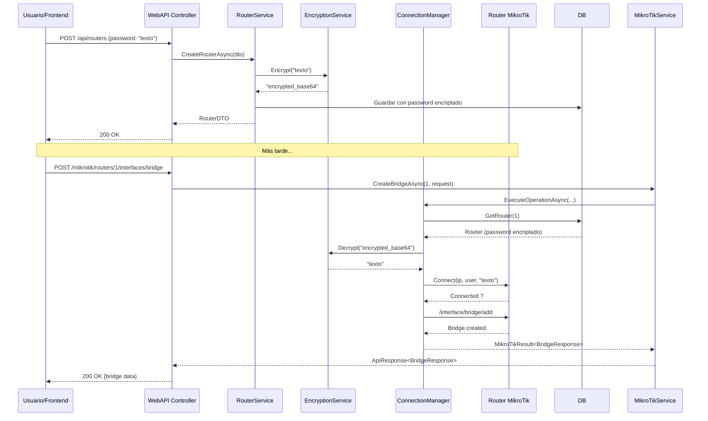

# ?? MikroClean - API de Gestión MikroTik

Sistema completo de gestión multi-tenant para routers MikroTik con conexiones dinámicas, retry policies y encriptación de credenciales.

---

## ?? Características Principales

### ?? Seguridad
- ? **Encriptación AES-256** de contraseñas de routers
- ? Clave secreta configurable en appsettings
- ? Soft delete para todos los registros
- ? Audit logging de operaciones

### ?? Multi-Tenant
- ? **Connection Pool por organización**
- ? Aislamiento de conexiones entre organizaciones
- ? Límite de conexiones concurrentes configurable
- ? Sistema de licencias por organización

### ?? Resiliencia
- ? **Retry policies con Polly** (exponential backoff)
- ? Reintentos automáticos en errores transitorios
- ? Health monitoring de conexiones
- ? Reconexión automática

### ?? Operaciones Tipadas
- ? Request/Response específicos por operación
- ? Type-safe operations
- ? Fácil extensión para nuevas operaciones

### ? Performance
- ? **Memory cache** para routers y estados
- ? Reutilización de conexiones
- ? Operaciones asíncronas
- ? Warm-up de conexiones

---

## ??? Arquitectura

```
???????????????????????????????????????????????????????????
?                    MikroClean.WebAPI                     ?
?  • Controllers (REST API)                                ?
?  • Swagger/OpenAPI                                       ?
???????????????????????????????????????????????????????????
                     ?
???????????????????????????????????????????????????????????
?                 MikroClean.Application                   ?
?  • Services (OrganizationService, RouterService,        ?
?    MikroTikService)                                      ?
?  • DTOs & Models                                         ?
?  • MikroTik Operations (Bridge, VLAN, Firewall, etc.)  ?
???????????????????????????????????????????????????????????
                     ?
???????????????????????????????????????????????????????????
?                   MikroClean.Domain                      ?
?  • Entities (Router, Organization, License, etc.)       ?
?  • Interfaces (Repositories, Services)                   ?
?  • MikroTik Abstractions                                 ?
???????????????????????????????????????????????????????????
                     ?
???????????????????????????????????????????????????????????
?                MikroClean.Infrastructure                 ?
?  • MikroTikConnectionManager                            ?
?  • RouterConnectionPool                                  ?
?  • MikroTikClient (tik4net wrapper)                     ?
?  • AesEncryptionService                                  ?
?  • Repositories & DbContext                              ?
???????????????????????????????????????????????????????????
```

---

## ?? Quick Start

### 1. Prerrequisitos

- .NET 8 SDK
- SQL Server 2019+
- Router MikroTik con API habilitada (puerto 8728)
- Visual Studio 2022 o VS Code

### 2. Clonar Repositorio

```bash
git clone https://github.com/Joasper/MikroTIk-Router-API.git
cd MikroTIk-Router-API
```

### 3. Configurar Base de Datos

```json
// MikroClean.WebAPI/appsettings.Development.json
{
  "ConnectionStrings": {
    "Connection": "Server=localhost;Database=MikroCleanDB;User Id=sa;Password=TuPassword;"
  },
  "Encryption": {
    "SecretKey": "MikroClean-Dev-Secret-Key-2024-min32chars"
  }
}
```

### 4. Aplicar Migraciones

```bash
cd MikroClean.Infrastructure
dotnet ef database update
```

### 5. Instalar Dependencias

```bash
dotnet restore
```

### 6. Ejecutar API

```bash
cd MikroClean.WebAPI
dotnet run
```

?? **API corriendo en**: https://localhost:7000  
?? **Swagger**: https://localhost:7000/swagger

---

## ?? Paquetes NuGet

### MikroClean.Infrastructure
- `Microsoft.EntityFrameworkCore` (8.0.24)
- `Microsoft.EntityFrameworkCore.SqlServer` (8.0.24)
- `tik4net` (3.5.0) - Cliente MikroTik API
- `Polly` (8.2.0) - Retry policies
- `Microsoft.Extensions.Caching.Memory` (8.0.1)

### MikroClean.Application
- `Microsoft.Extensions.Logging.Abstractions` (8.0.0)

---

## ?? Endpoints Disponibles

### Routers (CRUD con Encriptación)

| Método | Endpoint | Descripción |
|--------|----------|-------------|
| GET | `/api/routers/organization/{orgId}` | Listar routers por organización |
| GET | `/api/routers/{id}` | Obtener router por ID |
| POST | `/api/routers` | Crear router (password se encripta) |
| PUT | `/api/routers/{id}` | Actualizar router |
| DELETE | `/api/routers/{id}` | Eliminar router (soft delete) |
| POST | `/api/routers/{id}/test` | Probar conexión |

### MikroTik Operations

#### Gestión de Conexiones
| Método | Endpoint | Descripción |
|--------|----------|-------------|
| GET | `/api/mikrotik/routers/{id}/test-connection` | Probar conexión |
| GET | `/api/mikrotik/routers/{id}/status` | Estado de conexión |
| POST | `/api/mikrotik/organizations/{id}/warm-up` | Pre-calentar conexiones |

#### Interfaces
| Método | Endpoint | Descripción |
|--------|----------|-------------|
| POST | `/api/mikrotik/routers/{id}/interfaces/bridge` | Crear bridge |
| POST | `/api/mikrotik/routers/{id}/interfaces/vlan` | Crear VLAN |
| GET | `/api/mikrotik/routers/{id}/interfaces` | Listar interfaces |

#### IP Address
| Método | Endpoint | Descripción |
|--------|----------|-------------|
| POST | `/api/mikrotik/routers/{id}/ip/address` | Agregar dirección IP |

#### Firewall
| Método | Endpoint | Descripción |
|--------|----------|-------------|
| POST | `/api/mikrotik/routers/{id}/firewall/rules` | Crear regla firewall |

#### System
| Método | Endpoint | Descripción |
|--------|----------|-------------|
| GET | `/api/mikrotik/routers/{id}/system/resources` | Recursos del sistema |

### Organizations

| Método | Endpoint | Descripción |
|--------|----------|-------------|
| GET | `/api/organizations` | Listar organizaciones |
| GET | `/api/organizations/{id}` | Obtener organización |
| POST | `/api/organizations` | Crear organización |
| PUT | `/api/organizations/{id}` | Actualizar organización |
| DELETE | `/api/organizations/{id}` | Eliminar organización |

---

## ?? Documentación Completa

### ?? Guías Disponibles:

1. **[COMPLETE_USAGE_GUIDE.md](./COMPLETE_USAGE_GUIDE.md)** 
   - Guía completa de uso con ejemplos
   - Escenarios comunes
   - Troubleshooting

2. **[MIKROTIK_ARCHITECTURE.md](./MIKROTIK_ARCHITECTURE.md)**
   - Arquitectura detallada del sistema
   - Connection pooling
   - Retry policies
   - Cómo agregar nuevas operaciones

3. **[ENCRYPTION_GUIDE.md](./ENCRYPTION_GUIDE.md)**
   - Sistema de encriptación AES-256
   - Gestión de SecretKey
   - Seguridad y best practices
   - Migración de passwords

4. **[MIKROTIK_USAGE_GUIDE.md](./MIKROTIK_USAGE_GUIDE.md)**
   - Ejemplos de API REST
   - Uso desde código C#
   - Testing

---

## ?? Configuración de Seguridad

### appsettings.Development.json

```json
{
  "ConnectionStrings": {
    "Connection": "Server=localhost;Database=MikroCleanDB;User Id=sa;Password=YourPassword;"
  },
  "Encryption": {
    "SecretKey": "CHANGE-THIS-KEY-MIN-32-CHARS-RANDOM"
  },
  "MikroTik": {
    "ConnectionTimeout": 10,
    "CommandTimeout": 30,
    "MaxConnectionsPerOrganization": 20,
    "RetryPolicy": {
      "MaxRetryAttempts": 3,
      "InitialDelaySeconds": 1,
      "MaxDelaySeconds": 10,
      "BackoffMultiplier": 2.0
    }
  }
}
```

> ?? **IMPORTANTE**: Cambia `Encryption:SecretKey` por una clave aleatoria de mínimo 32 caracteres

### Generar SecretKey Segura:

```powershell
# PowerShell
-join ((48..57) + (65..90) + (97..122) | Get-Random -Count 64 | ForEach-Object {[char]$_})
```

---

## ?? Ejemplo de Uso Rápido

### 1. Crear Organización

```bash
curl -X POST https://localhost:7000/api/organizations \
  -H "Content-Type: application/json" \
  -d '{
    "name": "Mi Empresa S.A.",
    "email": "contacto@miempresa.com",
    "phone": "555-1234"
  }'
```

### 2. Crear Router (Password se Encripta)

```bash
curl -X POST https://localhost:7000/api/routers \
  -H "Content-Type: application/json" \
  -d '{
    "name": "Router Principal",
    "ip": "192.168.1.1",
    "user": "admin",
    "password": "MikroTikPass123!",
    "organizationId": 1
  }'
```

### 3. Crear Bridge en el Router

```bash
curl -X POST https://localhost:7000/api/mikrotik/routers/1/interfaces/bridge \
  -H "Content-Type: application/json" \
  -d '{
    "name": "bridge-lan",
    "comment": "Bridge principal"
  }'
```

### 4. Ver Interfaces del Router

```bash
curl https://localhost:7000/api/mikrotik/routers/1/interfaces
```

---

## ?? Flujo de Trabajo Típico



---

## ?? Testing

### Unit Tests (Ejemplo)

```csharp
[Fact]
public async Task CreateRouter_EncryptsPassword()
{
    // Arrange
    var mockEncryption = new Mock<IEncryptionService>();
    mockEncryption
        .Setup(e => e.Encrypt("plaintext"))
        .Returns("encrypted_base64");

    var service = new RouterService(
        _routerRepo,
        _orgRepo,
        mockEncryption.Object,
        _connectionManager,
        _unitOfWork,
        _logger
    );

    var createDto = new CreateRouterDTO
    {
        Name = "Test Router",
        Ip = "192.168.1.1",
        User = "admin",
        Password = "plaintext",
        OrganizationId = 1
    };

    // Act
    var result = await service.CreateRouterAsync(createDto);

    // Assert
    Assert.Equal(ResponseStatus.Success, result.Status);
    mockEncryption.Verify(e => e.Encrypt("plaintext"), Times.Once);
}
```

---

## ?? Base de Datos

### Entidades Principales:

- **Organizations**: Organizaciones del sistema
- **Licenses**: Licencias por organización
- **Users**: Usuarios del sistema
- **Routers**: Routers MikroTik (passwords encriptados)
- **RouterStatus**: Estado de conexión de routers
- **UserRouterAccess**: Acceso de usuarios a routers
- **SystemRoles/Permissions**: Roles y permisos del sistema
- **RouterRoles/Permissions**: Roles y permisos por router
- **AuditLogs**: Registro de auditoría
- **Notifications**: Notificaciones del sistema

---

## ??? Tecnologías

- **.NET 8**
- **Entity Framework Core 8.0.24**
- **SQL Server**
- **tik4net 3.5.0** (Cliente API MikroTik)
- **Polly 8.2.0** (Resilience & Retry Policies)
- **Swagger/OpenAPI**

---

## ?? Documentación Disponible

| Documento | Descripción |
|-----------|-------------|
| **[COMPLETE_USAGE_GUIDE.md](./COMPLETE_USAGE_GUIDE.md)** | Guía completa de uso con ejemplos |
| **[MIKROTIK_ARCHITECTURE.md](./MIKROTIK_ARCHITECTURE.md)** | Arquitectura del sistema MikroTik |
| **[ENCRYPTION_GUIDE.md](./ENCRYPTION_GUIDE.md)** | Sistema de encriptación de passwords |
| **[MIKROTIK_USAGE_GUIDE.md](./MIKROTIK_USAGE_GUIDE.md)** | Ejemplos adicionales de uso |
| **[DATABASE_SETUP_README.md](./DATABASE_SETUP_README.md)** | Configuración de base de datos |

---

## ?? Roadmap

### ? Fase 1: Core (Completado)
- [x] Arquitectura de capas
- [x] CRUD de organizaciones
- [x] CRUD de routers con encriptación
- [x] Connection Manager con pooling
- [x] Retry policies
- [x] Operaciones básicas MikroTik

### ?? Fase 2: Operaciones Avanzadas
- [ ] DHCP Server
- [ ] DNS
- [ ] NAT/Masquerade
- [ ] Wireless Networks
- [ ] Queue (QoS)
- [ ] Routing
- [ ] VPN (IPSec, L2TP, PPTP)

### ?? Fase 3: Monitoreo
- [ ] Background health check service
- [ ] Notificaciones de routers offline
- [ ] Dashboard en tiempo real
- [ ] Métricas de performance
- [ ] Alertas configurables

### ?? Fase 4: Seguridad Avanzada
- [ ] Autenticación JWT
- [ ] Autorización por roles
- [ ] Rate limiting
- [ ] Azure Key Vault integration
- [ ] Logs de auditoría mejorados

### ?? Fase 5: Features Adicionales
- [ ] Backup/Restore de configuraciones
- [ ] Plantillas de configuración
- [ ] Scripting automatizado
- [ ] Reportes y analytics
- [ ] Multi-idioma

---

## ?? Contribuir

### Agregar Nueva Operación MikroTik:

1. **Crear modelos en Domain**:
```csharp
// MikroClean.Domain/MikroTik/Operations/OperationModels.cs
public class CreateDhcpServerRequest { ... }
public class DhcpServerResponse { ... }
```

2. **Implementar operación en Application**:
```csharp
// MikroClean.Application/MikroTik/Operations/DhcpOperations.cs
public class CreateDhcpServerOperation : IMikroTikOperation<...> { ... }
```

3. **Agregar método en IMikroTikService** y su implementación

4. **Crear endpoint en Controller**

Ver [MIKROTIK_ARCHITECTURE.md](./MIKROTIK_ARCHITECTURE.md#cómo-agregar-nuevas-operaciones) para detalles.

---

## ?? Troubleshooting

### Error: "Invalid object name 'Organizations'"

```bash
dotnet ef database update --project MikroClean.Infrastructure
```

### Error: "Encryption:SecretKey no configurada"

Agregar en `appsettings.json`:
```json
{
  "Encryption": {
    "SecretKey": "tu-clave-secreta-minimo-32-caracteres"
  }
}
```

### Error: "Authentication failed" con MikroTik

Verificar en el router:
```routeros
/ip service enable api
/user print detail
# Verificar que el usuario tiene policy: api,read,write
```

Ver [COMPLETE_USAGE_GUIDE.md](./COMPLETE_USAGE_GUIDE.md#troubleshooting) para más soluciones.

---

## ?? Soporte

- **Issues**: https://github.com/Joasper/MikroTIk-Router-API/issues
- **Documentación MikroTik**: https://wiki.mikrotik.com/wiki/Manual:API
- **tik4net**: https://github.com/danikf/tik4net

---

## ?? Licencia

[Definir licencia]

---

## ????? Autor

**Joasper**  
GitHub: [@Joasper](https://github.com/Joasper)

---

## ?? Agradecimientos

- [tik4net](https://github.com/danikf/tik4net) - Cliente .NET para API MikroTik
- [Polly](https://github.com/App-vNext/Polly) - Biblioteca de resiliencia
- Comunidad de MikroTik

---

## ?? Status del Proyecto


**Última actualización**: Enero 2024
